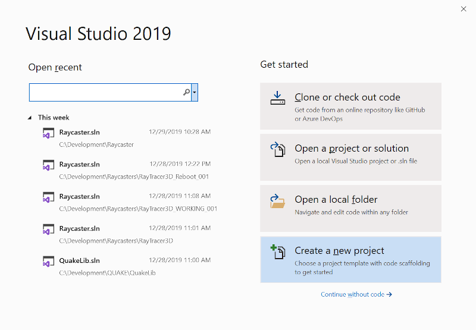
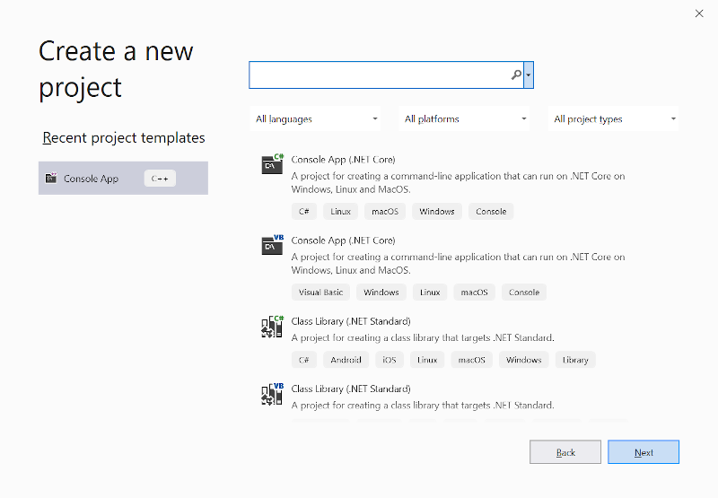
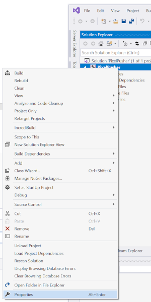
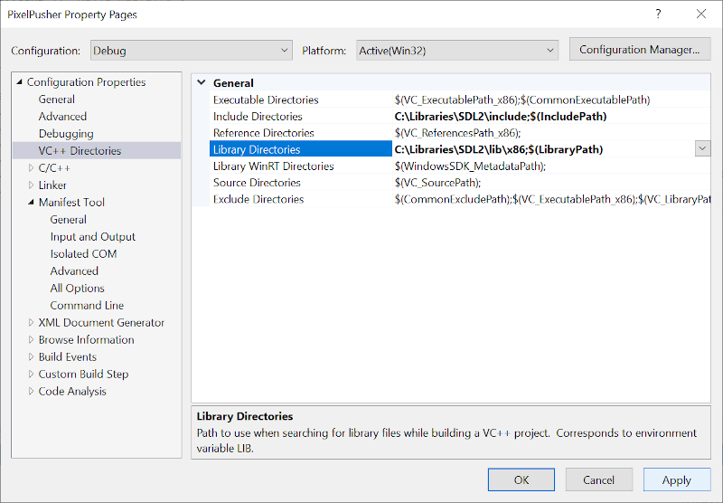
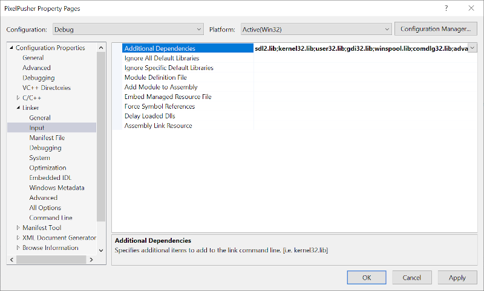
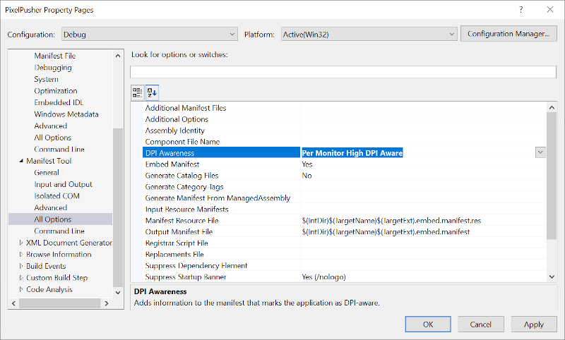

#Fast Pixel Plotting with SDL (C++)

## Step 1 - Install SDL (Simple Direct Media Layer)

https://www.libsdl.org/download-2.0.php

Runtime Binaries:

  * SDL2-2.0.10-win32-x86.zip (32-bit Windows)
  
  * SDL2-2.0.10-win32-x64.zip (64-bit Windows)
  
Development Libraries:

  * SDL2-devel-2.0.10-VC.zip (Visual C++ 32/64-bit)

Create a new Visual Studio project

Choose Console App project template

Configure your project

Edit project properties

Add SDL include and library directories

Add SDL library as a dependency

Set project to handle High DPI

